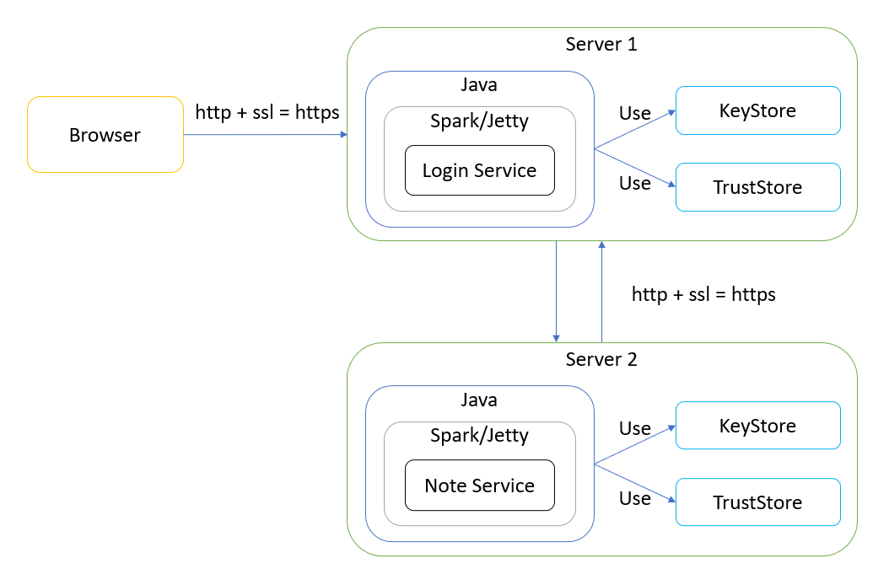
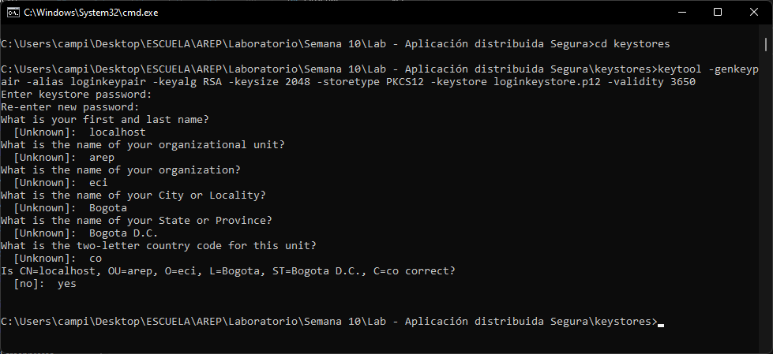
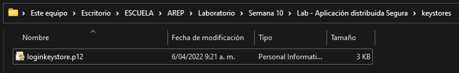
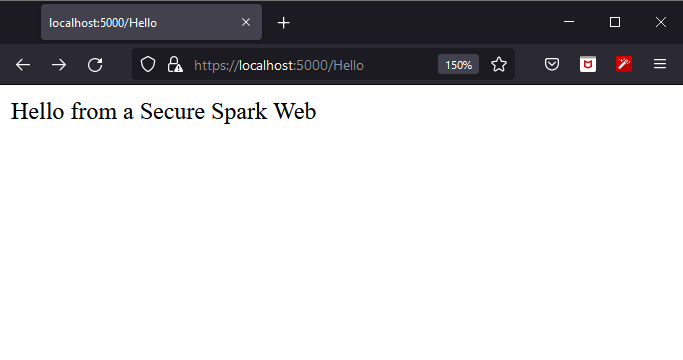
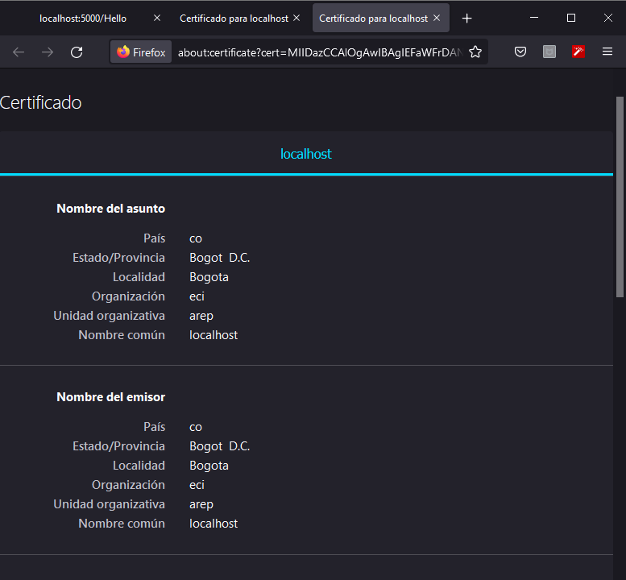
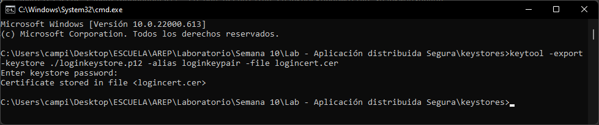
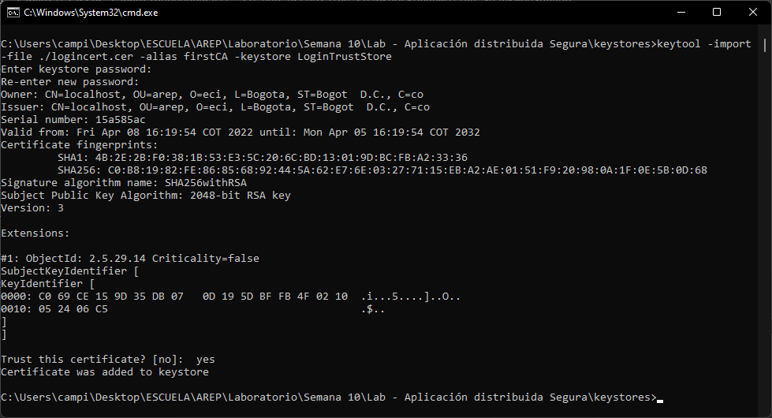

# Aplicación distribuida segura en todos sus frentes
## Arquitecturas Empresariales (AREP)
#### Camilo Andrés Pichimata Cárdenas
##### Abril del 2022

## Descripción
En el presente laboratorio se tiene como fin desarrollar una aplicación Web segura con los siguientes requerimientos:

+ Se debe permitir un acceso seguro desde el browser a la aplicación. Es decir debe garantizar autenticación, autorización e integridad de usuarios.

+ Se deben tener al menos dos computadores comunicandose entre ellos y el acceso de servicios remotos debe garantizar: autenticación, autorización e integridad entre los servicios. Nadie puede invocar los servicios si no está autorizado.

+ Explicar como se escalaría la arquitectura de seguridad para incorporar nuevos servicios.

La aplicación web a desarrollar tiene como fin la creación y almacenamiento de notas rápidas por parte del usuario, su arquitectura se presenta a continuación:



## Arquitectura de seguridad del prototipo

### Acceso seguro

Para permitir acceso seguro a los usuarios se utilizarán llaves públicas, llaves privadas y certificados con el fin de garantizar la autenticación, autorización e integridad de los usuarios y entre los diferentes servicios desplegados.

Para esto comenzamos creando un par de llaves mediante la herramienta `keytool`, el comando a ejecutar es el siguiente:

```
keytool -genkeypair -alias loginkeypair -keyalg RSA -keysize 2048 -storetype PKCS12 -keystore loginkeystore.p12 -validity 3650
```

Esto nos genera un archivo llamado `loginkeystore.p12` el cuál se almacena en la carpeta **keystores** como se puede ver a continuación:





En este caso se generaron las llaves usando como contraseña los digitos del 1 al 6 (`123456`)

A continuación para poder realizar la conexión segura en la aplicación se agregó la siguiente línea al método `main` donde se inicializa el servidor:

```java
// Especificación
void spark.Spark.secure(String keystoreFile, String keystorePassword, String truststoreFile, String truststorePassword)

// Implementación en la inicialización del servidor
secure(getKeystore(), "123456", null, null);
```

En este caso, el primer argumento, se hace un llamado al método `getKeyStore`, este tiene como fin retornar un String con la el path para acceder al archivo generado al usar la herramienta **keytool**, su implementación es la siguiente:

```java
static String getKeystore() {
	if (System.getenv("KEYSTORE") != null) {
        return System.getenv("keystore");
	}
	return "keystores/loginkeystore.p12";
}
```

Después de realizadas estas configuraciones se inicia el servicio usando el siguiente comando:

```bash
mvn exec:java -Dexec.mainClass="co.edu.escuelaing.AppDistribuidaSegura.SecureSparkWeb"
```

Después de inicializado el servicio ingresamos a la siguiente dirección con el fin de verificar que la conexión se realiza de forma segura, mediante el uso del protocolo https:

```
https://localhost:5000/Hello
```

Al ingresar a dicha dirección desde el navegador se puede ver que la página carga correctamente y muestra el mensaje especificado:



De acuerdo con esto se puede ver que la página está usando las llaves anteriormente creadas para realizar la conexión, si verificamos el certificado podemos ver los datos ingresados anteriormente:



 Esto muestra que la conexión si se está realizando de la forma esperada.

### Autenticación

Para realizar la autenticación de manera segura, se hace uso del cifrado de contraseñas mediante el uso del algoritmo de `hash-256`, el usuario ingresa sus datos y al momento de que da click en el botón **Login** se obtiene el hash de la contraseña ingresada y este es enviado al servidor que verifica si el usuario realmente se encuentra registrado o no.

En este caso en memoria se encuentran 3 usuarios registrados, cada uno con 2 atributos, ___name___ y ___password___, el nombre de usuario con el que se registró y el código hash de su contraseña, la implementación realizada es la siguiente

```java
public static void main(String[] args) {
	// Inicialización de usuarios registrados
	UserApp user1 = new UserApp("User1", "de7d0966dd91649474ecd891568e59977165c1d80a745a2e62599ec810b8c551");
	UserApp user2 = new UserApp("User2", "3a09990e3ab649f1c81c22d21c9a52f6f889632f41db9987e1d9c043626dd7d3");
	UserApp user3 = new UserApp("User3", "056f0753b4fa50c639811bd7500b2f3f5af973911a9da8e640f98769afa645f7");
	RegisteredUsers registeredUsers = new RegisteredUsers();
	registeredUsers.AddNewUser(user1);
	registeredUsers.AddNewUser(user2);
	registeredUsers.AddNewUser(user3);

	// Inicialización del servidor
	// . . .
}
```

### Conexión segura entre servidores

Para realizar una conexión segura entre los servidores se exporta el certificado a un un archivo empleando el siguiente comando: 

```bash
keytool -export -keystore ./loginkeystore.p12 -alias loginkeypair -file logincert.cer
```

Al ejecutar el comando se pide la contraseña anteriormente dada al certificado y se da enter, la ejecución se puede ver a continuación:



Después de eso se importa el certificado, a un TrustStore empleando el siguiente comando

```bash
keytool -import -file ./logincert.cer -alias firstCA -keystore LoginTrustStore
```

Al ejecutar el comando se pide ingresar una clave para el TrustStore, la cuál se debe colocar 2 veces, luego se muestra información del certificado a importar, ingresamos `yes` para confirmar la importación o `no` para cancelar. La salida en consola es la siguiente: 



Esto hace que el servidor no acepte llamados o peticiones de ningún cliente, excepto los que se encuentran registrados en su TrustStore, de esta forma se asegura que solo se acepten conexiones permitidas y se de respuesta a peticiones de clientes autorizados.